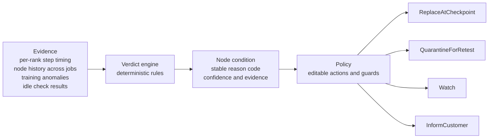

# Node Verdict

When a GPU training job slows down, is it the node or the job? Node Verdict answers that before anything gets replaced.

It is a small, working proof of concept: a verdict engine, a policy layer, and a simulator. The timing data comes from real production traces that ByteDance published. The node history is synthetic and labeled that way.

## The problem

Training jobs run on many machines in lockstep. If one is slow or broken, the whole job waits. Clouds already replace machines that fail outright. The quiet cases are harder:

1. **Slow node.** It still runs, just behind its peers.
2. **Bad chip.** It returns wrong answers without an error.
3. **Customer setup.** The node is fine. The job is slow because of how it was set up.

From the outside, all three look the same. The expensive mistake goes both ways. Replace a healthy node and you burn a scarce spare without fixing the job. Leave a bad node in place and the job keeps running slow.

Some numbers from published work:

- In ByteDance's study of 3,079 training jobs, 42.5% of jobs straggled and 10.4% of GPU hours were wasted. Worker problems explained most of the slowdown in only 1.7% of straggling jobs. Those jobs ran 3.04x slower, against 1.28x on average. Most causes were in the job itself, such as uneven pipeline stages and uneven sequence lengths. [Source 4]
- Meta built a lemon-node detector that was right more than 85% of the time. Large-job failures (512 GPUs and up) dropped from 14% to 4%. [Source 3]
- Silent data corruption evades standard checks. ByteDance reports that synthetic benchmarks miss over 60% of defective GPUs. [Source 5]

## What exists today

Detection is not new. This is what I found. My search was not exhaustive, and CoreWeave's preview may go further than its docs show.

| Who | What it does | What it leaves open |
|---|---|---|
| CoreWeave Mission Control | Tracks node health over time and replaces degraded nodes. Straggler Detection (preview) finds the exact GPU and node falling behind. | A person still decides if the cause is the node, the network, or the training code. |
| Crusoe AutoClusters | Replaces nodes on critical hardware failures, for workloads that opt in. | Issues below the threshold are reported as detection only. |
| AWS EKS, NVIDIA NVSentinel | Detect and replace nodes that fail outright. | Slowness with no fault code. |
| Research: Alibaba GREYHOUND, Guard, SysOM-AI | Detect slow GPUs and links, and compare a slow rank to a healthy one. | Published as research. I found no cloud product built on them. |

I did not find a product that joins three things: history across customers' jobs, a node-or-job verdict, and a verdict tied to a repair action. That is the gap this project explores.

## How it works



The core idea is the comparison group. A rank is compared to its **stage peers** (the same pipeline stage in other data-parallel replicas), not to the whole job. Stages do different amounts of work, so a whole-job comparison blames healthy nodes for how the job was split.

The engine applies these rules in order. The first one that fires wins for a node.

| # | Rule | Verdict | Owner of the fix |
|---|---|---|---|
| 1 | Training anomalies across two or more jobs, idle checks pass, timing is normal | `SDCSuspect` | node |
| 2 | Slow against stage peers in most steps, and history shows it across jobs | `NodeLemon` | node |
| 2 | Same, but only this job is on record | `NodeSuspect` | node |
| 3 | The whole stage is slow and the rank is normal for its stage | `WorkloadImbalance` | job |

A node that matches none of these gets **no condition**. Absent is not the same as healthy. A node with no evidence should not report "healthy" any more than a disabled monitor should.

Uneven sequence lengths show up as a job-level signature: forward and backward times move together and vary step to step. That only adds a note to a stage verdict. It does not flag single ranks.

There is no model in the decision path. Every verdict can be explained ("rule 2 fired, here is the evidence"), reproduced, and tuned by editing a threshold.

## Run it

```bash
pip install -e ".[dev]"
python -m node_verdict demo        # full walkthrough
python -m node_verdict verdicts    # verdict table
python -m node_verdict verdicts --json            # node conditions as JSON
python -m node_verdict verdicts --no-history      # what changes without cross-job history
python -m node_verdict simulate --sensitivity
pytest
```

Python 3.11 or newer. No GPU, no network. The repo ships small derived tables, not the raw traces.

## The demo

A 32-node pool with 4 spares and three jobs. Each job runs on a real ByteDance trace:

| Job | Trace | What is actually wrong |
|---|---|---|
| job-a | AR | One worker is artificially slowed, a stand-in for a bad node |
| job-b | ST | Uneven pipeline stage partitioning |
| job-c | SE | Uneven sequence lengths |

A fourth problem is planted in the node history: node N27 shows training anomalies across jobs while passing every idle check and running at normal speed.

```
job    node  verdict            owner  confidence  why
-----  ----  -----------------  -----  ----------  --------------------------------------------------------------------------------------------------
job-a  N00   NodeLemon          node   high        Slowdown follows this node across different jobs.
job-b  N22   WorkloadImbalance  job    high        Slowdown follows pipeline stage 3, not this node (stage partitioning).
job-b  N23   WorkloadImbalance  job    high        Slowdown follows pipeline stage 3, not this node (stage partitioning).
job-c  N27   SDCSuspect         node   high        Training anomalies follow this node across jobs while idle checks pass.
job-c  N28   WorkloadImbalance  job    medium      Slowdown follows pipeline stage 1, not this node (stage partitioning and uneven sequence lengths).
job-c  N29   WorkloadImbalance  job    medium      Slowdown follows pipeline stage 1, not this node (stage partitioning and uneven sequence lengths).
job-c  N30   WorkloadImbalance  job    medium      Slowdown follows pipeline stage 1, not this node (stage partitioning and uneven sequence lengths).
job-c  N31   WorkloadImbalance  job    medium      Slowdown follows pipeline stage 1, not this node (stage partitioning and uneven sequence lengths).

Planted bad node N00: found. Planted corrupting chip N27: found. Planted nodes wrongly cleared: 0.
```

With no earlier history, the engine downgrades N00 to `NodeSuspect` (low confidence) and says nothing about N27. One job cannot separate a bad node from a bad position. See `examples/verdicts_no_history.txt`.

## The API

A verdict is a Kubernetes-style node condition with a stable reason code. This is the full output for N00 (`examples/verdicts.json` has all nodes):

```json
{
  "apiVersion": "nodeverdict.dev/v1alpha1",
  "node": "N00",
  "job": "job-a",
  "condition": {
    "type": "NodeVerdict",
    "status": "True",
    "reason": "NodeLemon",
    "message": "Slowdown follows this node across different jobs.",
    "lastTransitionTime": "2026-10-06T00:00:00Z",
    "attributedTo": "node",
    "confidence": "high",
    "evidence": [
      {"signal": "peer_ratio", "value": "2.35", "note": "median compute vs same-stage peers"},
      {"signal": "persistence", "value": "1.00", "note": "share of steps above threshold"},
      {"signal": "elevated_jobs", "value": "5", "note": "distinct jobs where it was the outlier"},
      {"signal": "lemon_score", "value": "10.00", "note": "weighted history signals"}
    ]
  }
}
```

Reason codes are a contract. Customers write automation against them, so renaming one or changing its meaning is a breaking change. A test pins the four codes. `confidence` is an ordinal band (low, medium, high), not a probability.

## Policy

Attribution says whose fault it is. Policy decides the action. They are separate so an operator can change an action without touching the engine.

| Verdict | Default action |
|---|---|
| `NodeLemon` | Replace at the next checkpoint |
| `SDCSuspect` | Quarantine and retest under realistic load |
| `NodeSuspect` | Watch. No node change |
| `WorkloadImbalance` | Tell the customer. No node change |

Two guards sit on top. A fleet cap never changes more than 20% of the pool at once. A correlation guard halts automation when half of one job's nodes would change together, because that points at something shared, not at the nodes.

## What the simulator shows

It compares four policies on the demo pool. The middle two are controls I added so attribution gets no credit it did not earn.

- **naive:** flag any rank slower than the job's median rank, replace the worst first, mid-run.
- **naive+checkpoint:** the same flags, but wait for a checkpoint. Any policy can do this.
- **peer-aware:** flag a rank that is persistently slow against its stage peers, replace it at a checkpoint. No history, no corruption signal. This is the fair baseline: roughly what a good straggler detector wired to auto-repair would do.
- **attributed:** the verdict engine plus policy. Also waits for a checkpoint.

```
metric                                  naive  naive+checkpoint  peer-aware  attributed
--------------------------------------  -----  ----------------  ----------  ----------
Healthy nodes replaced                  3      3                 0           0
Spares used (of 4)                      4      4                 1           2
Flagged nodes left unserved             3      3                 0           0
Bad node fixed                          yes    yes               yes         yes
Corrupting chip pulled                  no     no                no          yes
Slow jobs given the right owner (of 3)  1      1                 1           3
Goodput, node-weighted (assumed model)  73.2%  78.0%             78.3%       78.2%
  job-a                                 75.6%  81.7%             81.7%       81.7%
  job-b                                 80.0%  84.0%             84.8%       84.8%
  job-c                                 61.4%  64.4%             65.0%       64.4%
```

The counts above the goodput line do not depend on any assumption. Goodput is the ideal run time divided by the actual run time. Per-job slowdowns come from ByteDance's published what-if analysis. Three inputs are my assumptions, not measurements: repair acts after 20% of the run, the checkpoint interval, and the cost of a restart.

```
checkpoint interval  vs naive  vs naive+checkpoint  vs peer-aware
-------------------  --------  -------------------  -------------
every 50 steps       +2.7 pts  +0.2 pts             -0.2 pts
every 100 steps      +5.0 pts  +0.2 pts             -0.2 pts
every 200 steps      +9.2 pts  +0.2 pts             -0.2 pts
```

**What I take from this:**

- Almost all of the goodput gain comes from two things any good system can do: wait for a checkpoint, and compare a rank to its stage peers. Attribution adds nothing to goodput on top of that. It scores 0.2 points below peer-aware, because pulling the chip costs a restart and this model does not price corrupted training.
- Peer-aware detection already stops the waste of healthy nodes. The naive policy is a straw man and I do not lead with it.
- What attribution adds over a good detector does not depend on my assumptions. It pulls the corrupting chip, which timing alone cannot see. It gives every slow job an owner (3 of 3, against 1 of 3), so the two customers whose jobs are the problem are told so. And it will not replace a node on one job of evidence (see the no-history run, where N00 drops to `Watch`).
- In a supply-limited cloud, spares are the constraint. Attribution spends one more spare than peer-aware, on purpose, to pull a chip that would otherwise keep corrupting training runs.

## Data: real and synthetic

| Input | Status |
|---|---|
| Per-rank compute time per step, three jobs | **Real.** Derived from ByteDance's sample traces (Apache-2.0) |
| Per-job slowdown and its split by worker and stage | **Real.** Trimmed from ByteDance's published what-if results |
| Which node each trace rank runs on | **Synthetic.** The traces carry ranks, not node names |
| Each node's history across earlier jobs | **Synthetic.** Deterministic, seeded, labeled |
| Training anomaly events for silent data corruption | **Synthetic** |

`scripts/prepare_traces.py` rebuilds the derived tables from a clone of the ByteDance repo. Job SE has 64 ranks. I keep 8 (the first four data-parallel replicas of each stage) so the pool stays at 32 nodes. Its what-if numbers still describe the full job.

## Limits

1. **Three traces.** I set the thresholds by hand and checked them on these three jobs only. They are not validated on held-out data. Treat them as starting points.
2. **History is synthetic.** The signal types follow what Meta reports (jobs that excluded a node, repair tickets, multi-node failures). The weights are illustrative. This is not Meta's model.
3. **The data may not carry over.** ByteDance ran a dedicated cluster with plenty of network capacity. A shared cloud may see more node problems than workload problems.
4. **Monitoring costs something.** I did not measure overhead. AWS found its own health agent slowed training jobs. I treat under 1% as a budget (ByteDance reports 0.86% for online corruption detection). That is a target here, not a result.
5. **The goodput model is simple.** It uses assumed restart costs and treats a workload problem as unfixable by replacing hardware.
6. **Not production code.** It defines behavior and thresholds. It does not operate hardware. GPU error codes and collective-communication details belong with the people who run the fleet.

## Design decisions

- **Rules, not a model.** A decision that blocks or replaces hardware needs to be explainable and cheap to tune.
- **Compare to stage peers.** It is the difference between blaming a node and blaming how the job was split.
- **Absent is not healthy.** No evidence means no condition.
- **A workload verdict never changes a node.** The owner of the fix is part of the verdict.
- **Reason codes are an API.** Pinned by a test.
- **Control for timing.** The `naive+checkpoint` policy separates what attribution adds from what a better restart policy adds.

See `docs/design.md` for the longer version and what I would build next.

## Layout

```
src/node_verdict/
  signals.py       per-rank signals from a trace
  history.py       node history across jobs
  attribution.py   the verdict engine
  conditions.py    node conditions and the reason-code contract
  policy.py        actions and guards
  scenario.py      the 32-node demo pool
  simulator.py     naive vs attributed
data/derived/      small tables derived from the ByteDance traces
scripts/           rebuild the derived tables
tests/             unit and scenario tests, including the pinned reason codes
examples/          captured demo output and sample JSON
docs/design.md     design notes
```

## Sources

1. [The Llama 3 Herd of Models](https://arxiv.org/pdf/2407.21783) (Meta, 2024)
2. [Efficient Training of LLMs on Distributed Infrastructures: A Survey](https://arxiv.org/pdf/2407.20018) (Alibaba failure rate)
3. [Revisiting Reliability in Large-Scale ML Research Clusters](https://arxiv.org/pdf/2410.21680) (Meta, lemon detection)
4. [Understanding Stragglers in Large Model Training Using What-if Analysis](https://www.usenix.org/system/files/osdi25-lin-jinkun.pdf) (ByteDance, OSDI 2025), and its [artifact](https://github.com/ByteDance-Seed/StragglerAnalysis)
5. [SDCs in the Wild](https://www.usenix.org/conference/osdi26/presentation/zheng) and [AEGIS online SDC detection](https://www.usenix.org/conference/osdi26/presentation/lei) (ByteDance, OSDI 2026)
6. [Self-healing GPU nodes in Kubernetes](https://thenewstack.io/self-healing-gpu-nodes/) (AWS EKS team, sponsored article)
7. [NVSentinel overview](https://docs.nvidia.com/nvsentinel) (NVIDIA)
8. [ClusterMAX 2.0 review: Together](https://clustermax.semianalysis.com/cloudreview/together) (SemiAnalysis)
9. [Crusoe AutoClusters](https://docs.crusoecloud.com/orchestration/cmk/autoclusters) and [Active Health Checks](https://docs.crusoecloud.com/orchestration/cmk/active-stress-testing) (Crusoe docs)
10. [CoreWeave Mission Control](https://coreweave.com/mission-control) and [GPU Straggler Detection](https://docs.coreweave.com/products/sunk/manage_sunk/straggler-detection) (CoreWeave docs)
11. [GREYHOUND](https://www.usenix.org/conference/atc25/presentation/wu-tianyuan) (Alibaba and HKUST, ATC 2025), [Guard](https://mlsys.org/virtual/2026/poster/3608) (MLSys 2026), [SysOM-AI](https://arxiv.org/pdf/2603.29235) (arXiv, 2026)

## License

MIT for the code. The derived tables in `data/derived/` come from ByteDance's Apache-2.0 artifact. See `NOTICE` and `LICENSES/`.
