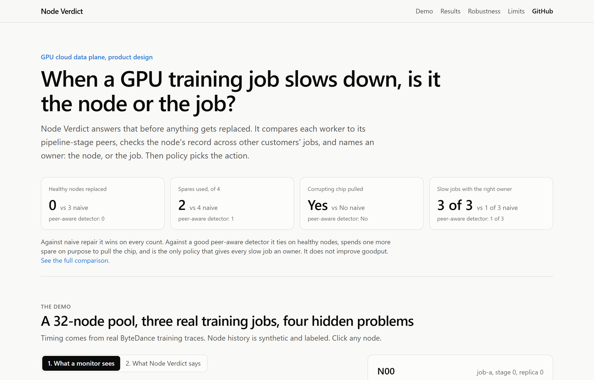
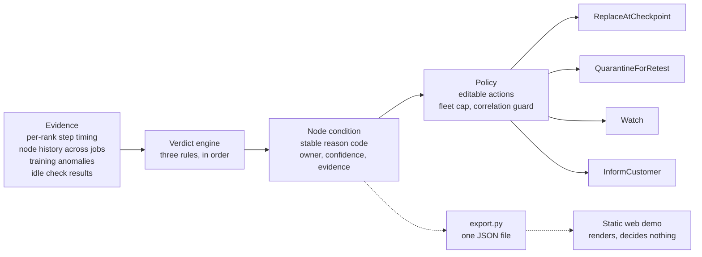
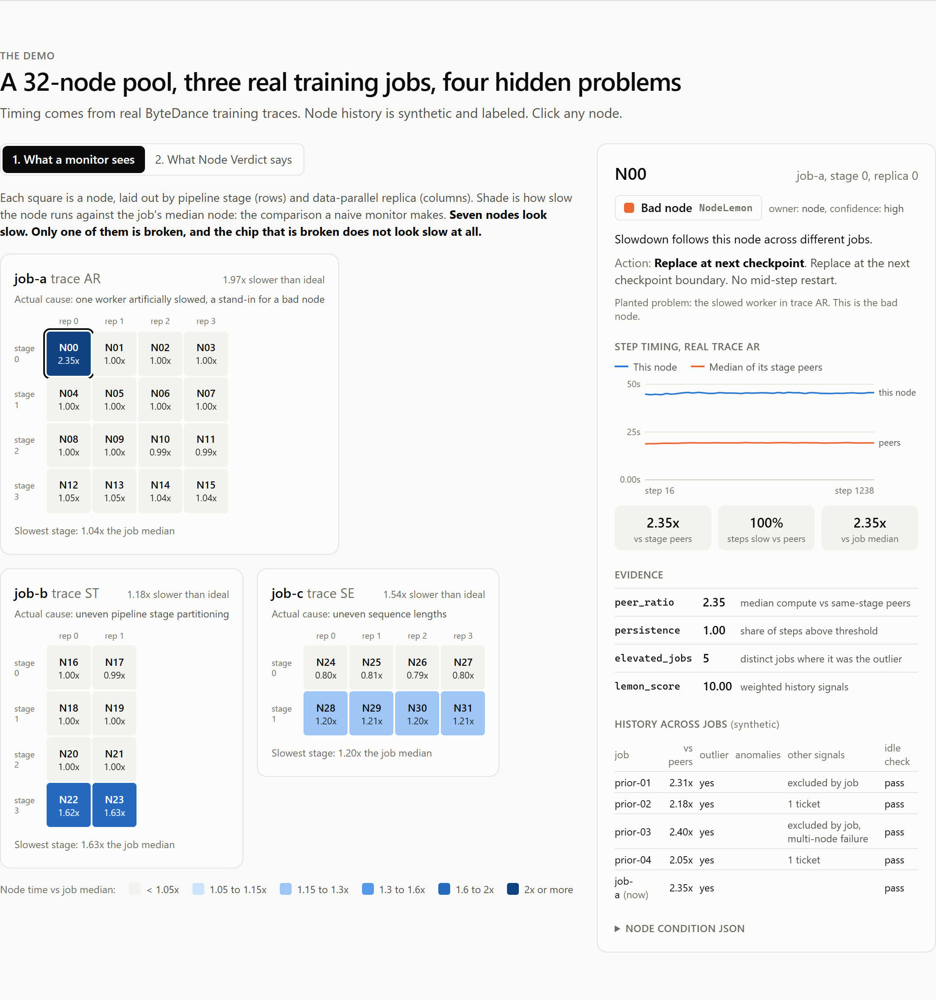
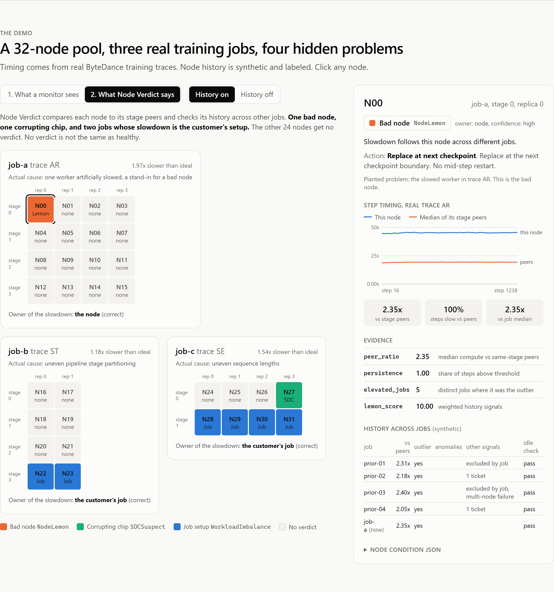

# Node Verdict

[](https://www.python.org/)
[](tests/)
[](LICENSE)
[](#whats-working-today)
[](https://nicopavez.github.io/node-verdict/)

When a GPU training job slows down, is it the node or the job? Node Verdict answers that before anything gets replaced. It compares each worker to its pipeline-stage peers, checks the node's record across other customers' jobs, and names an owner: the node, or the job. Then a separate policy layer picks the action.

It is a working proof of concept: a rules engine, a policy layer, a simulator, and a static web demo. The timing data is real, from production traces ByteDance published. The node history is synthetic and labeled that way everywhere.

**[Open the live demo](https://nicopavez.github.io/node-verdict/)**. No sign-in, works on a phone.

[](https://nicopavez.github.io/node-verdict/)

```
$ python -m node_verdict verdicts

job    node  verdict            owner  confidence  why
-----  ----  -----------------  -----  ----------  ----------------------------------------------------------------------
job-a  N00   NodeLemon          node   high        Slowdown follows this node across different jobs.
job-b  N22   WorkloadImbalance  job    high        Slowdown follows pipeline stage 3, not this node (stage partitioning).
job-b  N23   WorkloadImbalance  job    high        Slowdown follows pipeline stage 3, not this node (stage partitioning).
job-c  N27   SDCSuspect         node   high        Training anomalies follow this node across jobs while idle checks pass.
job-c  N28   WorkloadImbalance  job    medium      Slowdown follows pipeline stage 1, not this node (stage partitioning and uneven sequence lengths).
...
8 nodes have a verdict. 24 nodes have none (no condition is not the same as healthy).
```

## The result in one table

Same 32-node pool, same three jobs, three repair policies. The counts do not depend on any assumption.

| | Naive | Peer-aware detector | Node Verdict |
|---|---|---|---|
| Healthy nodes replaced | 3 | 0 | 0 |
| Spares used (of 4) | 4 | 1 | 2 |
| Corrupting chip pulled | No | No | **Yes** |
| Slow jobs given the right owner | 1 of 3 | 1 of 3 | **3 of 3** |
| Goodput (assumed model) | 73.2% | 78.3% | 78.2% |

What I take from it:

1. Naive repair is a straw man. A good detector that compares each rank to its stage peers already stops the waste of healthy nodes. I do not lead with the naive comparison.
2. What Node Verdict adds over a good detector is two things timing alone cannot do. It catches a chip that corrupts training while looking healthy. And it tells the two customers whose jobs are the problem that it is their setup.
3. It does not add goodput. It scores 0.2 points below the peer-aware detector, because pulling the chip costs a restart and the model does not price corrupted training. I say so rather than tune it away.

## Why this, specifically

Clouds already replace machines that fail outright. The quiet cases are harder: a node that runs slow, a chip that returns wrong answers without an error, and a job that is slow because of how the customer set it up. From the outside they look the same, and the mistake is expensive both ways. Replace a healthy node and you burn a scarce spare without fixing the job. Leave a bad node in place and the job keeps running slow.

- In ByteDance's study of 3,079 training jobs on 128 GPUs or more, 42.5% of jobs ran at least 10% slower because of stragglers, and 10.4% of all allocated GPU hours were wasted. Worker problems explained more than half of the slowdown in only 1.7% of straggling jobs, and that is after the cluster's health checks. When a worker was the cause, it was severe: 3.04x slower, against 1.28x on average. Most causes were in the job itself, such as uneven pipeline stages and uneven sequence lengths. [Source 2]
- Meta built a lemon-node detector with more than 85% accuracy. Large-job failures (512 GPUs and up) dropped from 14% to 4%. Their conclusion: "Historic data is necessary to find defective nodes." [Source 1]
- Silent data corruption evades standard checks. ByteDance reports that synthetic benchmarks miss over 60% of defective GPUs. [Source 3]
- AWS does not auto-repair on some node conditions because they "often indicate issues with application behavior, workload configuration, or resource limits rather than node-level failures." That is the node-or-job question. Without an answer, the default is no repair at all. [Source 4]

Every number above is checked against its source in [docs/sources.md](docs/sources.md), with the quote.

The part only a cloud can do: a customer sees one job. The cloud sees every job a node has served. A slowdown that follows one node across different jobs is the node. A slowdown that follows one stage inside one job is the job.

## What exists today

Detection is not new. This is what I found. My search was not exhaustive, and these products may do more than their public docs show.

| Who | What it does | What it leaves open |
|---|---|---|
| CoreWeave Mission Control | Tracks node health over time and replaces degraded nodes. Straggler Detection, on by default in SUNK v8 and later, names the GPU rank and node falling behind. | The operator drains and requeues. The docs do not claim to separate node, network and training-code causes. |
| Crusoe AutoClusters | Detects hardware failures and can restart or replace the node. Remediation is off by default and turned on per issue type. | Hardware faults only. Otherwise it detects and notifies. |
| AWS EKS, NVIDIA NVSentinel | Detect and replace or reset nodes that fail outright. | Slowness with no fault code. |
| Research: Alibaba GREYHOUND and SysOM-AI, Guard | Detect slow GPUs and links. GREYHOUND mitigates them. SysOM-AI diagnoses root cause across layers on 80,000+ GPUs at Alibaba. | Each runs inside one operator's own fleet. None that I found joins node history across customers' jobs to a repair action. |

I did not find a product that joins three things: history across customers' jobs, a node-or-job verdict, and a verdict tied to a repair action. That is the gap this project explores.

## Architecture



The core idea is the comparison group. A rank is compared to its **stage peers** (the same pipeline stage in other data-parallel replicas), not to the whole job. Stages do different amounts of work. In trace ST, the last stage runs 1.63x the job median on every replica because it carries the loss layer. A whole-job comparison replaces two healthy machines for that. A stage-peer comparison sees that the stage is slow, not the nodes.

The engine applies three rules in order. The first one that fires wins for a node.

| # | Rule | Verdict | Owner of the fix |
|---|---|---|---|
| 1 | Training anomalies in two or more jobs, idle checks pass, timing is normal | `SDCSuspect` | node |
| 2 | Slower than stage peers by 1.15x in 80% of steps or more, and history shows it in other jobs | `NodeLemon` | node |
| 2 | Same, but only this job is on record | `NodeSuspect` | node |
| 3 | The whole stage runs 1.15x the job median or more, and the rank matches its stage peers | `WorkloadImbalance` | job |

A node that matches none of these gets **no condition**. Absent is not the same as healthy. A node with no evidence should not report "healthy" any more than a disabled monitor should.

## Why rules, not a model

A decision that blocks or replaces hardware has to be explainable, reproducible, and cheap to tune. Every verdict here can be explained ("rule 2 fired, here is the evidence"), reproduced exactly, and changed by editing one threshold. Meta made the same call: their lemon thresholds "were tuned manually based on accuracy and false positive rate." A model can come later, fit to labeled repair outcomes, once there are labels. There is no LLM anywhere in this repo.

## The demo

A 32-node pool with 4 spares and three jobs. Each job runs on a real ByteDance trace:

| Job | Trace | What is actually wrong |
|---|---|---|
| job-a | AR | One worker artificially slowed, a stand-in for a bad node (N00) |
| job-b | ST | Uneven pipeline stage partitioning |
| job-c | SE | Uneven sequence lengths |

A fourth problem is planted in the synthetic node history: N27 shows training anomalies across jobs while passing every idle check and running at normal speed.

The web demo has one toggle that carries the whole argument. **What a monitor sees** shades each node by how slow it runs against the job median. Seven nodes look slow. **What Node Verdict says** shows that one of them is a bad node and six are the customers' job setup. And a node that looked perfectly normal is the corrupting chip.

| What a monitor sees | What Node Verdict says |
|---|---|
|  |  |

Turn cross-job history off and N00 drops to `NodeSuspect` (watch, no replacement), and N27 disappears. One job cannot separate a bad node from a bad position. That is the case for the cloud owning the call.

## What the simulator shows

Four policies on the same pool. The middle two are controls, so attribution gets no credit it did not earn.

- **naive:** flag any rank slower than the job's median rank, replace the worst first, mid-run.
- **naive+checkpoint:** the same flags, but wait for a checkpoint. Any policy can do this.
- **peer-aware:** flag a rank that is persistently slow against its stage peers, replace it at a checkpoint. No history, no corruption signal. This is the fair baseline: roughly what a good straggler detector wired to auto-repair would do.
- **attributed:** the verdict engine plus policy. Also waits for a checkpoint.

```
metric                                  naive  naive+checkpoint  peer-aware  attributed
--------------------------------------  -----  ----------------  ----------  ----------
Healthy nodes replaced                  3      3                 0           0
Spares used (of 4)                      4      4                 1           2
Flagged nodes left unserved             3      3                 0           0
Bad node fixed                          yes    yes               yes         yes
Corrupting chip pulled                  no     no                no          yes
Slow jobs given the right owner (of 3)  1      1                 1           3
Goodput, node-weighted (assumed model)  73.2%  78.0%             78.3%       78.2%
  job-a                                 75.6%  81.7%             81.7%       81.7%
  job-b                                 80.0%  84.0%             84.8%       84.8%
  job-c                                 61.4%  64.4%             65.0%       64.4%
```

Goodput is the ideal run time divided by the actual run time. Per-job slowdowns come from ByteDance's published what-if analysis. Three inputs are my assumptions, not measurements: repair acts after 20% of the run, a checkpoint every 100 steps, and a restart costs 10 steps.

```
checkpoint interval  vs naive  vs naive+checkpoint  vs peer-aware
-------------------  --------  -------------------  -------------
every 50 steps       +2.7 pts  +0.2 pts             -0.2 pts
every 100 steps      +5.0 pts  +0.2 pts             -0.2 pts
every 200 steps      +9.2 pts  +0.2 pts             -0.2 pts
```

Almost all of the goodput gain comes from two things any good system can do: wait for a checkpoint, and compare a rank to its stage peers. In a supply-limited cloud, spares are the constraint. So the case for attribution is spares spent on the right nodes and a named owner for every slow job. A goodput headline is not.

## How fragile are the thresholds?

I set the thresholds by hand on three traces, and the public artifact has no held-out data. So I checked the next best thing: sweep each threshold on its own and find the band where every verdict stays the same (`python -m node_verdict robustness`).

```
threshold        default  verdicts unchanged  range tested  tested against
---------------  -------  ------------------  ------------  -----------------
peer_threshold   1.15     1.02 to 2.32        1.02 to 2.50  real timing
persistence_min  0.80     0.05 to 1.00        0.05 to 1.00  real timing
stage_threshold  1.15     1.06 to 1.20        1.00 to 1.80  real timing
lemon_min_score  4        1 to 10             1 to 12       synthetic history
lemon_min_jobs   2        1 to 5              1 to 6        synthetic history
sdc_min_jobs     2        1 to 4              1 to 6        synthetic history
```

The stage threshold is the one that matters. Below 1.06, job-a's last stage (1.04x the job median) gets blamed on the customer's job. Above 1.20, job-c's slow stage (1.20x) is no longer explained. Both failures are safe: neither changes a node. At no setting tested does a healthy node get replaced or pulled.

This does not validate the thresholds for a real fleet. The peer threshold looks robust only because the planted slow worker runs 2.35x its peers. A degraded node in production may run 1.1x, which is where this threshold would actually be tested. The bands on history only show that the planted history is not borderline.

## The API

A verdict is a Kubernetes-style node condition with a stable reason code. This is the full output for N00 (`examples/verdicts.json` has all nodes):

```json
{
  "apiVersion": "nodeverdict.dev/v1alpha1",
  "node": "N00",
  "job": "job-a",
  "condition": {
    "type": "NodeVerdict",
    "status": "True",
    "reason": "NodeLemon",
    "message": "Slowdown follows this node across different jobs.",
    "lastTransitionTime": "2026-10-06T00:00:00Z",
    "attributedTo": "node",
    "confidence": "high",
    "evidence": [
      {"signal": "peer_ratio", "value": "2.35", "note": "median compute vs same-stage peers"},
      {"signal": "persistence", "value": "1.00", "note": "share of steps above threshold"},
      {"signal": "elevated_jobs", "value": "5", "note": "distinct jobs where it was the outlier"},
      {"signal": "lemon_score", "value": "10.00", "note": "weighted history signals"}
    ]
  }
}
```

Reason codes are a contract. Customers write automation against them, so renaming one or changing its meaning is a breaking change. A test pins the four codes. `confidence` is an ordinal band (low, medium, high), not a probability.

## Policy

Attribution says whose fault it is. Policy decides the action. They are separate so an operator can change an action without touching the engine.

| Verdict | Default action |
|---|---|
| `NodeLemon` | Replace at the next checkpoint |
| `SDCSuspect` | Quarantine and retest under realistic load |
| `NodeSuspect` | Watch. No node change |
| `WorkloadImbalance` | Tell the customer. No node change |

Two guards sit on top. A fleet cap never changes more than 20% of the pool at once, the same cap AWS uses for EKS auto repair. A correlation guard halts automation when half of one job's nodes would change together, because that points at something shared, not at the nodes. AWS describes exactly that failure: after a driver update changed a health value, "every GPU node was flagged unhealthy at once."

## Data: real and synthetic

| Input | Status |
|---|---|
| Per-rank compute time per step, three jobs | **Real.** Derived from ByteDance's sample traces (Apache-2.0) |
| Per-job slowdown and its split by worker and stage | **Real.** Trimmed from ByteDance's published what-if results |
| What actually caused each job's slowdown | **Real.** The trace labels |
| Which node each trace rank runs on | **Synthetic.** The traces carry ranks, not node names |
| Each node's history across earlier jobs | **Synthetic.** Deterministic, seeded, labeled |
| Training anomaly events for silent data corruption | **Synthetic** |

`scripts/prepare_traces.py` rebuilds the derived tables from a clone of the ByteDance repo. Job SE has 64 ranks. I keep 8 (the first four data-parallel replicas of each stage) so the pool stays at 32 nodes. Its what-if numbers still describe the full job.

## Limits, honestly

1. **Three traces.** I set the thresholds by hand and checked them on these three jobs only. They are not validated on held-out data. The robustness sweep shows they are not on a knife edge, not that they are right. Treat them as starting points.
2. **History is synthetic.** The signal types are a subset of what Meta reports (jobs that excluded a node, repair tickets, multi-node failures). The weights are illustrative. This is not Meta's model. Meta's lemons cause repeated job failures, while this project applies the same idea to slowdowns. Meta also found that exclusions on their own correlated weakly with failures.
3. **The data may not carry over.** ByteDance ran a dedicated training cluster with an overprovisioned network. A shared cloud may see more node problems than workload problems.
4. **Monitoring costs something.** I did not measure overhead. AWS found its own health agent caused periodic slowdowns in a customer's training job. I treat under 1% as a budget (ByteDance reports 0.86% for online corruption detection). That is a target here, not a result.
5. **The goodput model is simple.** It uses assumed restart costs, treats a workload problem as unfixable by replacing hardware, and does not price corrupted training.
6. **Not production code.** It defines behavior and thresholds. It does not operate hardware. GPU error codes and collective-communication details belong with the people who run the fleet.

## What's working today

- [x] Verdict engine with three ordered rules and four pinned reason codes
- [x] Stage-peer signals from real per-rank timing (three ByteDance traces)
- [x] Cross-job node history and the corruption signal (synthetic, labeled)
- [x] Policy layer with editable actions, a 20% fleet cap and a correlation guard
- [x] Simulator with two controls: naive+checkpoint and a peer-aware baseline
- [x] Threshold robustness sweep, including a check that no setting replaces a healthy node
- [x] Every README number checked against its source ([docs/sources.md](docs/sources.md))
- [x] Static web demo, exported from the engine, with a test that fails on drift
- [x] 47 tests, CI on Windows and Linux, deploy to GitHub Pages on every push to `main`
- [x] [One-pager](docs/one-pager.md) and [PRD](docs/PRD.md)

## Roadmap

- **v0 (this repo):** define the behavior. Rules, reason codes, policy, and a simulator that is honest about what attribution adds.
- **v1, shadow mode:** real inputs (node IDs from the scheduler, idle-check results and GPU error events from the fleet, per-rank step timing from the training framework). Run verdicts next to the existing repair loop without acting, and compare what it would have done. Test thresholds on traces I did not use to set them.
- **v2, customer surface:** publish verdicts as node conditions customers can automate on. Show which jobs run on impaired nodes. Fit the lemon weights to labeled repair outcomes. Define what "retest under realistic load" means for a suspected corrupting chip, and how long it takes.

## Run it

```bash
pip install -e ".[dev]"
python -m node_verdict demo              # full walkthrough
python -m node_verdict verdicts          # verdict table
python -m node_verdict verdicts --json            # node conditions as JSON
python -m node_verdict verdicts --no-history      # what changes without cross-job history
python -m node_verdict simulate --sensitivity
python -m node_verdict robustness        # where each threshold flips a verdict
pytest

# The web demo
python scripts/export_json.py            # regenerate web/src/data from the engine
cd web && npm ci && npm run dev          # http://localhost:3000
```

Python 3.11 or newer, Node 20 or newer for the web demo. No GPU, no network, no API keys. The repo ships small derived tables, not the raw traces.

## Project layout

```
src/node_verdict/
  signals.py       per-rank signals from a trace, compared to stage peers
  history.py       node history across jobs
  attribution.py   the verdict engine
  conditions.py    node conditions and the reason-code contract
  policy.py        actions and guards
  scenario.py      the 32-node demo pool
  simulator.py     naive, peer-aware and attributed repair
  robustness.py    threshold sweep
  export.py        one JSON file for the web demo
web/               static Next.js demo, renders the export, decides nothing
data/derived/      small tables derived from the ByteDance traces
scripts/           rebuild the derived tables, export the web data
tests/             engine, policy, simulator, robustness, export drift, reason-code contract, em dash check
examples/          captured CLI output and sample JSON
docs/
  one-pager.md     the problem and the proposal
  PRD.md           requirements, metrics, rollout
  design.md        design notes and decision table
  sources.md       every claim checked against its source
  screenshots/     the live demo
```

## Sources

1. [Revisiting Reliability in Large-Scale ML Research Clusters](https://arxiv.org/pdf/2410.21680) (Meta, lemon detection)
2. [Understanding Stragglers in Large Model Training Using What-if Analysis](https://www.usenix.org/system/files/osdi25-lin-jinkun.pdf) (ByteDance, OSDI 2025), and its [artifact](https://github.com/ByteDance-Seed/StragglerAnalysis)
3. [SDCs in the Wild](https://www.usenix.org/conference/osdi26/presentation/zheng) and [AEGIS online SDC detection](https://www.usenix.org/conference/osdi26/presentation/lei) (ByteDance, OSDI 2026)
4. [EKS node health](https://docs.aws.amazon.com/eks/latest/userguide/node-health.html), [EKS node repair](https://docs.aws.amazon.com/eks/latest/userguide/node-repair.html), [How EKS Auto Mode detects and repairs node failures](https://aws.amazon.com/blogs/containers/under-the-hood-how-amazon-eks-auto-mode-detects-repairs-and-diagnoses-node-failures/) (AWS), and [Self-healing GPU nodes in Kubernetes](https://thenewstack.io/self-healing-gpu-nodes/) (AWS EKS team, sponsored article)
5. [NVSentinel overview](https://docs.nvidia.com/nvsentinel) (NVIDIA)
6. [Crusoe AutoClusters](https://docs.crusoecloud.com/orchestration/cmk/autoclusters) and [Active Health Checks](https://docs.crusoecloud.com/orchestration/cmk/active-stress-testing) (Crusoe docs)
7. [CoreWeave Mission Control](https://coreweave.com/mission-control) and [GPU Straggler Detection](https://docs.coreweave.com/products/sunk/manage_sunk/straggler-detection) (CoreWeave docs)
8. [GREYHOUND](https://www.usenix.org/conference/atc25/presentation/wu-tianyuan) (Alibaba and HKUST, ATC 2025), [Guard](https://mlsys.org/virtual/2026/poster/3608) (MLSys 2026), [SysOM-AI](https://arxiv.org/pdf/2603.29235) (Alibaba, arXiv 2026)

## License

MIT for the code. The derived tables in `data/derived/` come from ByteDance's Apache-2.0 artifact. See `NOTICE` and `LICENSES/`.
