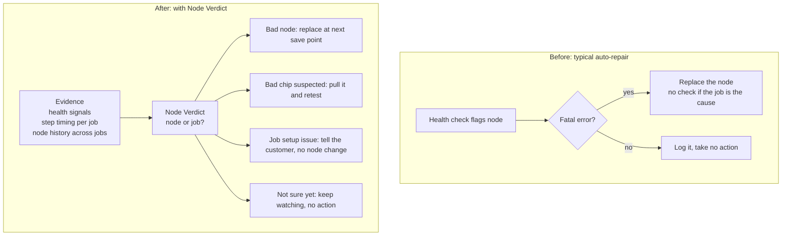

# Design notes

## What it is

Node Verdict sits between health signals and repair. Health checks say something looks wrong. Repair replaces a node. Node Verdict answers the question in between: whose fault is it?

The top lane describes a typical loop built around hard faults. It is not a claim about any one provider.

## Why the cloud should own it

A customer sees one job. The cloud sees every job a node has served. A slowdown that follows one node across different jobs is the node. A slowdown that follows one stage inside a single job is the job. Only the cloud has the history to tell them apart.

## Attribution

Rules run in a fixed order and the first match wins for a node.

1. **SDCSuspect.** Anomalies across two or more jobs, idle checks pass, timing is normal. Slowness cannot explain wrong answers, so this runs first.
2. **Persistent outlier.** Slow against stage peers in at least 80% of steps. `NodeLemon` if history shows it across jobs and the score clears a bar. Otherwise `NodeSuspect`.
3. **Slow stage.** The stage median is at least 1.15x the job median and the rank matches its stage peers. `WorkloadImbalance`.

The 1.15 threshold applies to both the peer comparison and the stage comparison. Defaults live in `AttributionConfig`.

### Robustness

`robustness.py` sweeps each threshold on its own and reports the band where every verdict matches the default run. The stage threshold is the narrow one: 1.06 to 1.20. Below that band a healthy stage gets a workload verdict. Above it a slow stage goes unexplained. Neither side changes a node, and no setting on any grid replaces or pulls a healthy node. This is a check against overfitting the demo, not a validation on held-out data.

### Why stage peers

Pipeline stages do different amounts of work. In the ST trace, stage 3 runs about 1.6x longer than the others on every replica. Compare each rank to the whole job and you flag both stage 3 nodes. Compare to stage peers and neither is an outlier, which is correct: the stage is slow, not the nodes.

### Lemon score

A weighted sum of the signal types Meta reports using: distinct jobs where the node was an outlier, jobs that excluded it, repair tickets, and multi-node failures it caused. The weights are illustrative. A real deployment would learn them from labeled repair outcomes.

## Policy

Actions are editable config in `PolicyConfig`. Two guards:

- **Fleet cap.** Never change more than 20% of the pool at once. This follows the lesson from EKS auto-repair.
- **Correlation guard.** If half of one job's nodes would change together, halt and hold for review. Many nodes failing together points at something shared.

## Decisions and alternatives

| Decision | Alternative | Why |
|---|---|---|
| Deterministic rules decide | A model decides | A verdict that blocks or replaces hardware has to be explainable, reproducible and cheap to tune |
| Compare to stage peers | Compare to the whole job | Whole-job comparison blames nodes for how the job was split |
| No condition when there is no evidence | Report `Healthy` | Absent is not healthy |
| Four reason codes, pinned by a test | Free-text reasons | Customers automate on these. Renames are breaking changes |
| Replace at a checkpoint | Replace immediately | Avoids losing work. Any policy can adopt it, so the simulator controls for it |
| Compare against a peer-aware baseline | Compare only against naive | Naive flags whole slow stages, so beating it proves little. Peer-aware detection is what a good straggler tool already does. Attribution has to show what it adds beyond that: the chip, an owner for every slow job, and no replacement on one job of evidence |
| Drop a rule that flagged single ranks slow in a few steps | Tune its threshold | The ranks sat at 5 to 14% against a 10% cutoff. That is noise, and tuning it to three traces would be overfitting |

## What I would build next

1. **Real inputs.** Node IDs from the scheduler, GPU error events and idle-check results from the fleet, and per-rank step timing from the training framework.
2. **Shadow mode.** Run verdicts next to the existing repair loop without acting. Compare what it would have done.
3. **Held-out validation.** Test the thresholds on traces I did not use to set them.
4. **Learned weights.** Fit the lemon score to labeled repair outcomes.
5. **Customer surface.** Publish verdicts as node conditions, and show which jobs are running on impaired nodes.
6. **Retest design.** What "retest under realistic load" means for a suspected corrupting chip, and how long it should take.
7. **Overhead budget.** Measure the monitoring cost against a 1% target.
